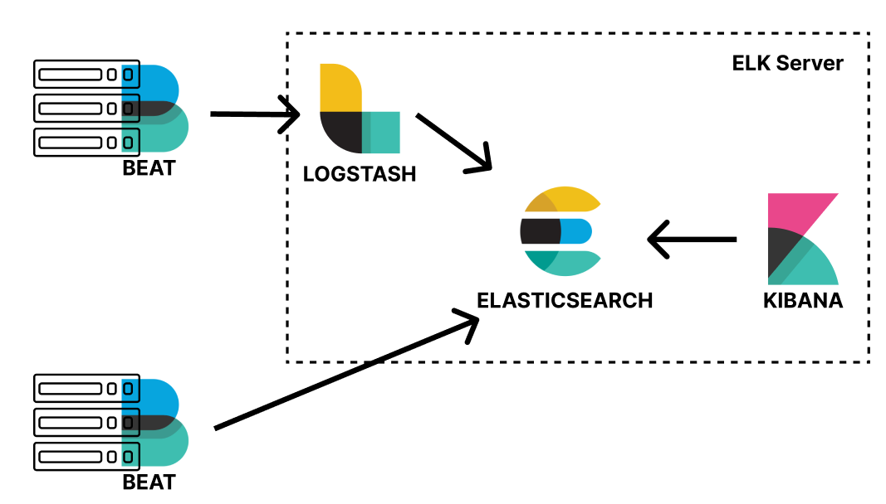

# ELK Stack simple demo



## Requirements
- Ansible
- Virtualbox
- Vagrant
- Vagrant plugins:
	* vagrant-hosts (2.9.0)
	* vagrant hostupdater (1.2.4)
```Vagrant
vagrant plugin install vagrant-hosts --plugin-version=2.9.0
vagrant plugin install vagrant-hostsupdater --plugin-version=1.2.4
```

## How to run
``` bash
./run_all.sh
```